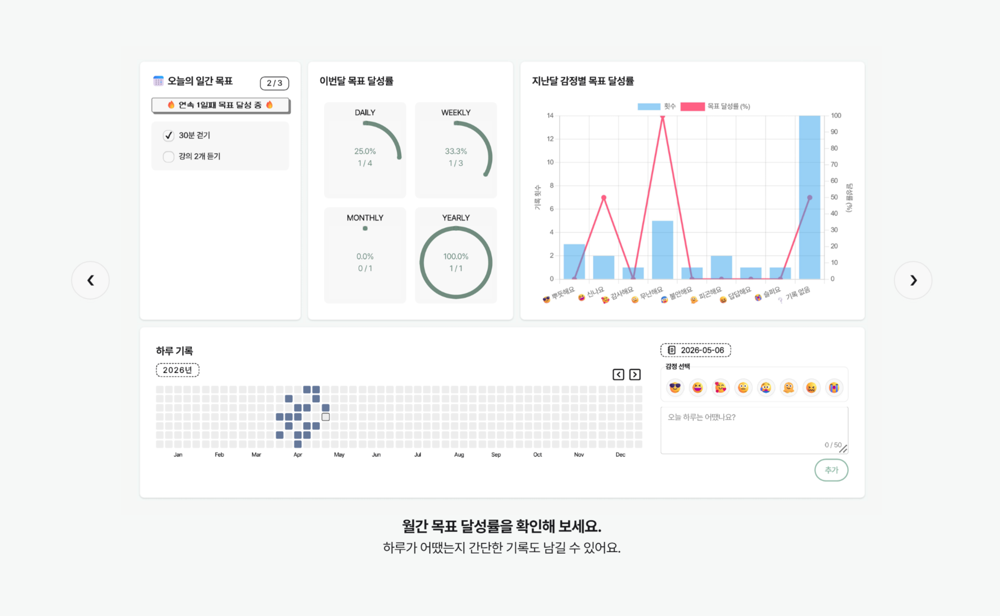
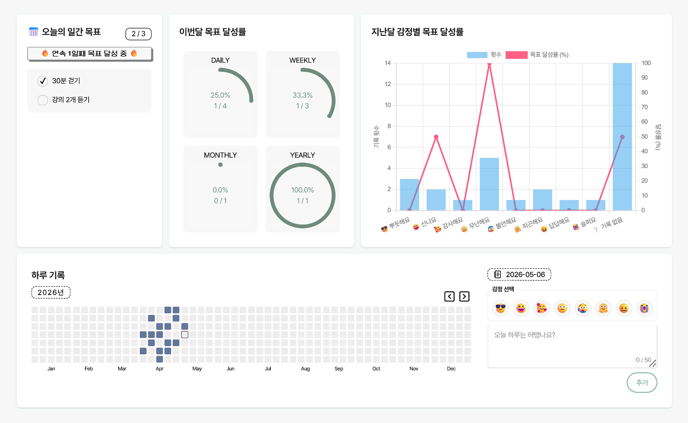
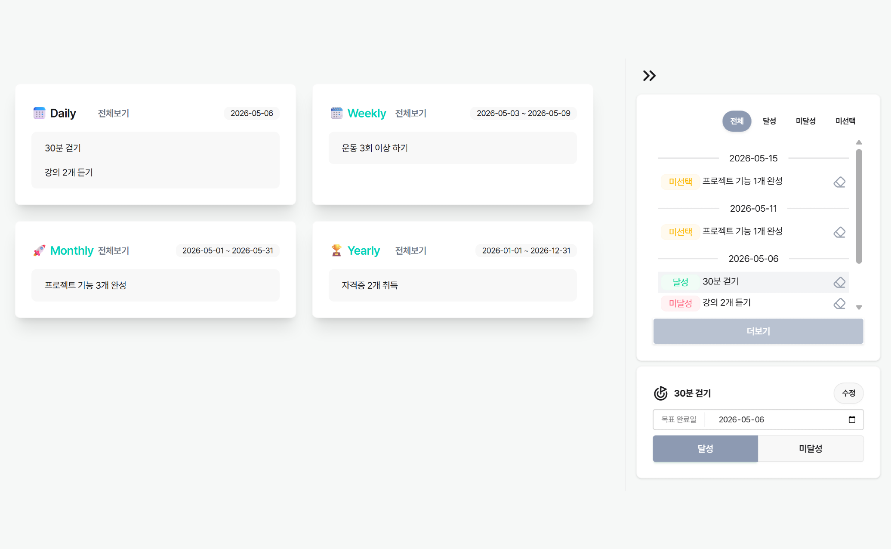
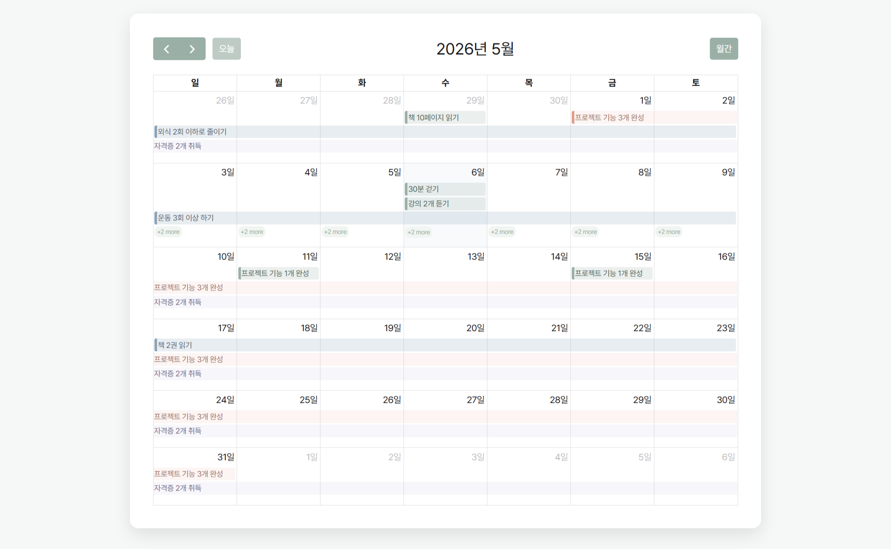
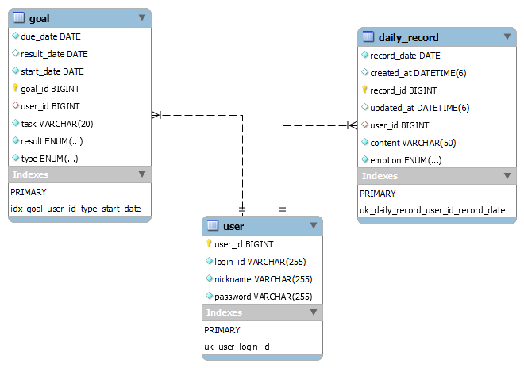

# goalmate

목표 관리 기능과 함께 시각화된 통계를 제공함으로써, 성취감을 느끼게 하고 꾸준한 목표 수행을 돕는 서비스

| 서비스 소개 | 대시보드 |
| :---: | :---: |
|  |  |

| 오늘의 목표 | 캘린더 |
| :---: | :---: |
|  |  |

---

## 🛠️ 사용 기술
- Backend: Java 21, Spring Boot 3.5, Spring Data JPA, MySQL
- Frontend: Thymeleaf, JavaScript, HTML/CSS
  - Libraries:
    - Tailwind CSS, daisyUI, Lucide Icons: UI 구성
    - Chart.js: 감정 기반 목표 달성률 시각화
    - Cal-Heatmap: 하루 기록 등록 여부 시각화
    - FullCalendar: 캘린더 기반 목표 조회 및 날짜 클릭을 통한 목표 관리
    - Toastify JS: 사용자 피드백(알림) 처리
- Tools: Git, GitHub, IntelliJ IDEA, Visual Studio Code

---

## 📌 주요 기능
1. 대시보드
    - 당월 목표 달성률 제공
    - 전월 감정 기반 목표 달성률 제공
    - 하루 기록(감정 선택 + 텍스트) CRUD

1. 목표 관리
    - 목표 CRUD
    - 캘린더 및 목록 기반 조회
    - 목표 수행 결과(달성/미달성) 등록

---

## 🧱 ERD

